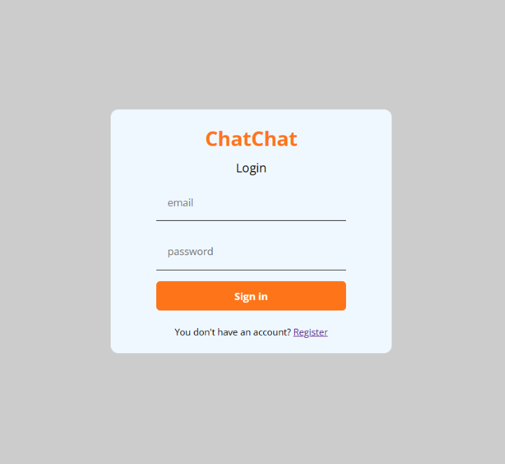
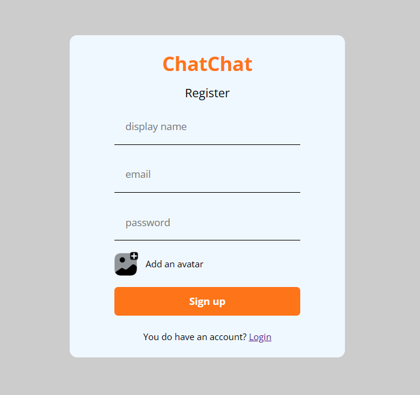
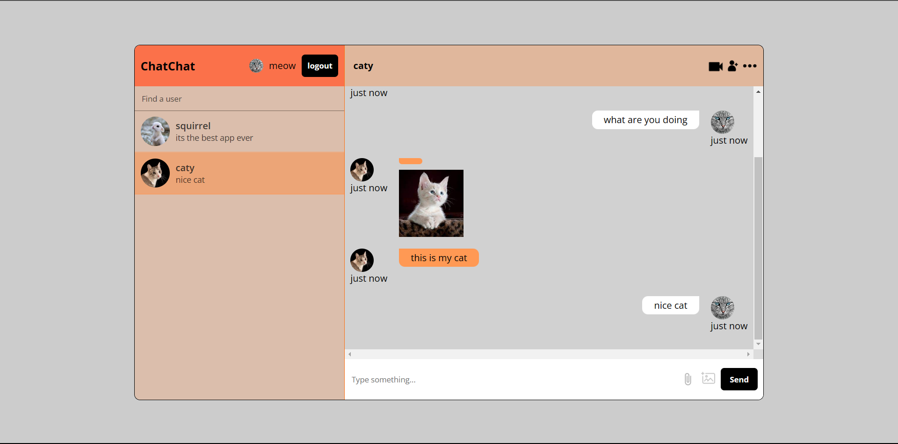

# chatchat

This web chat application is a real-time messaging platform that enables users to communicate with each other over the internet. The front-end is built using the popular React library, which allows for efficient and modular development of user interfaces. The back-end is powered by Firebase, a cloud-based platform that provides a range of services, including real-time database, hosting, and authentication.

Users can sign up for an account and log in to the web chat application, which will authenticate them and enable them to access the chat interface. Once logged in, users can create new chat rooms or join existing ones, and start messaging with other users in real-time. The chat application will store all messages in the Firebase real-time database, which will enable all users in a given chat room to see the same messages at the same time.

The web chat application is simple, intuitive, and easy to use. With React and Firebase, we've created a powerful combination that enables us to build real-time messaging applications quickly and easily.

# Login And Register page

 

# Home page

